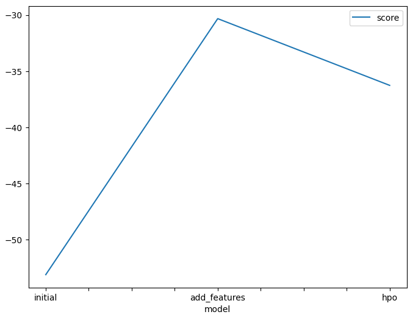
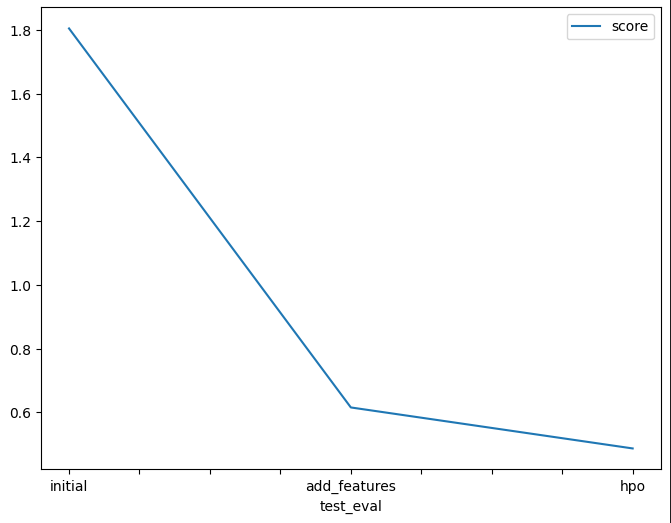

# Report: Predict Bike Sharing Demand with AutoGluon Solution
#### NAME HERE
Gilbert TCHEUGOUE DJISSITCHE
## Initial Training
### What did you realize when you tried to submit your predictions? What changes were needed to the output of the predictor to submit your results?
TODO: Add your explanation
The first time when I used the raw dataset without perfoming any data analysis or feature engineering the model did not perfomed as well as expected bescause it had a lot of error, In order to be able to submit my results to kaggle I needed to replace the negative numbers with 0 
### What was the top ranked model that performed?
TODO: Add your explanation
The  WeightedEnsemble_L3 model that used the data with created features 
## Exploratory data analysis and feature creation
### What did the exploratory analysis find and how did you add additional features?
TODO: Add your explanation
From plotting histograms at the exploratory data analysis (eda) step, I deduced that :
- some features were  binary such as [holiday, working day]
- some features were nearly normally distributed
### How much better did your model preform after adding additional features and why do you think that is?
TODO: Add your explanation
Because additional features can be good predictors to estimate the target value, in this case I decided to separate the date becuase it helps the model to analyse seasonality paterns in the data which can be usefull for a regression model
## Hyper parameter tuning
### How much better did your model preform after trying different hyper parameters?
TODO: Add your explanation
Hyper parameter tuning was usefull in some cases but it did not improve model performance by much, some configurations where usefull 
but others harmed the model performance
### If you were given more time with this dataset, where do you think you would spend more time?
TODO: Add your explanation
Do a more extensive data analysis in order to get more information about this dataset , and do more research about the hiperparameters
### Create a table with the models you ran, the hyperparameters modified, and the kaggle score.
|model|hpo1|hpo2|hpo3|score|
|--|--|--|--|--|
|initial|default_vals|default_vals|default_vals|1.80567|
|add_features|default_vals|default_vals|default_vals|0.48633|
|hpo|num_leaves: lower=26, upper=66|dropout_prob: 0.0, 0.5|num_boost_round: 100|0.61498|

### Create a line plot showing the top model score for the three (or more) training runs during the project.

TODO: Replace the image below with your own.

### Create a line plot showing the top kaggle score for the three (or more) prediction submissions during the project.

TODO: Replace the image below with your own.

## Summary
TODO: Add your explanation
in this project I was able to apply all the concepts that were covered in this unit of the course, by using this skills I was able to develop a machine learning regression model by using the autogluon framework, at the end the results were good because the kaggle score of my model was close to the professional developers with years of experince.